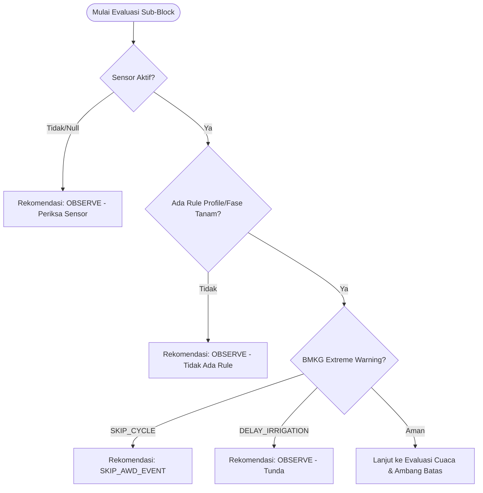
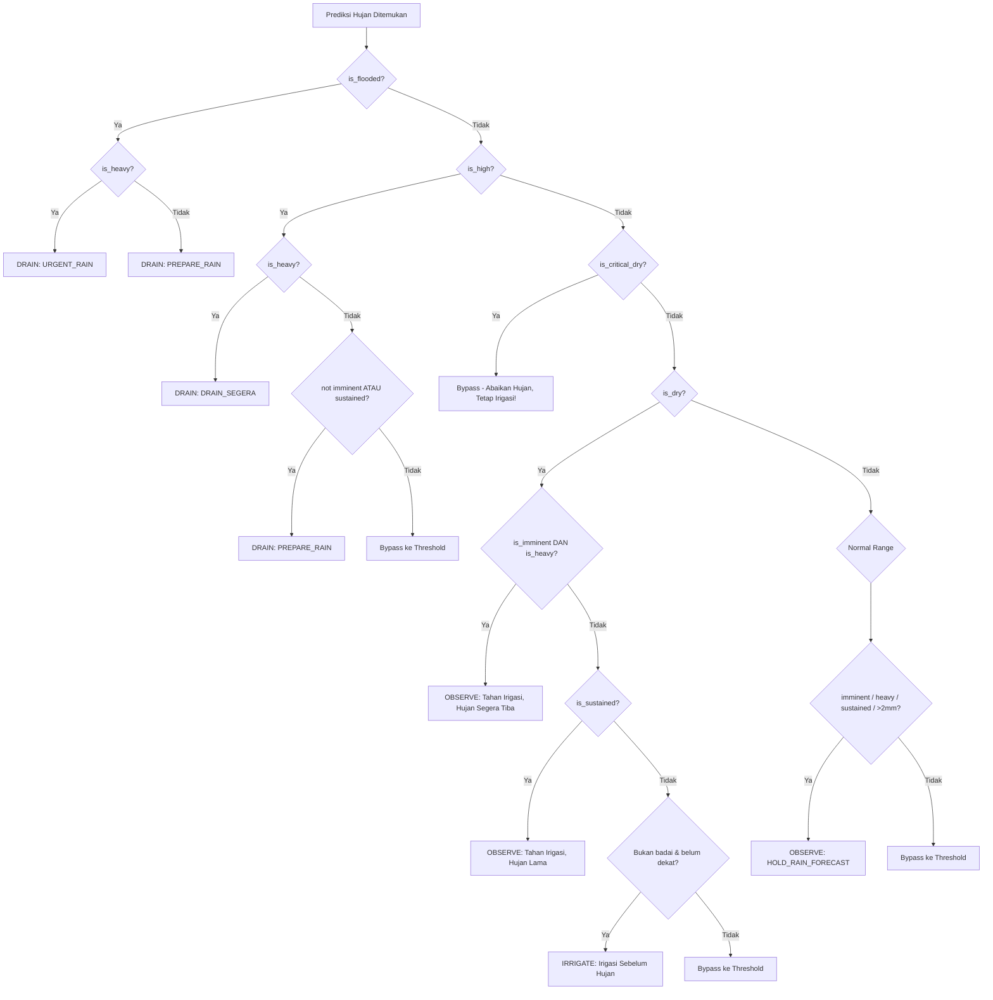
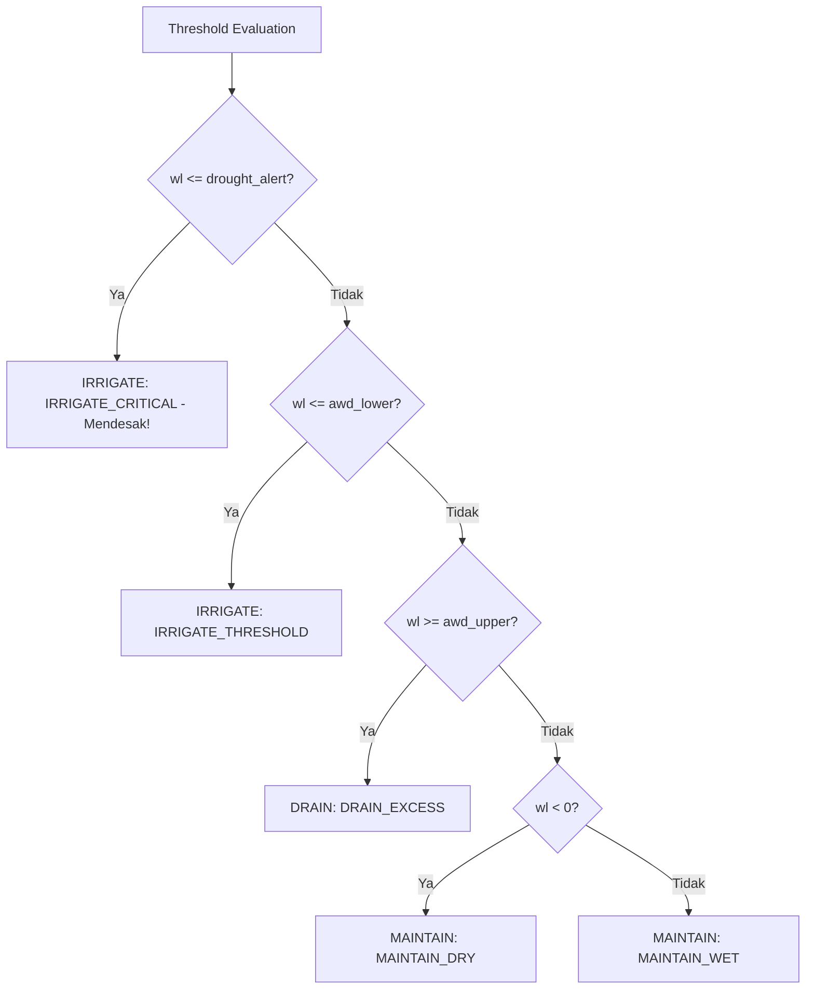

# Panduan Logika Decision Support System (DSS) AWD

Dokumen ini mendeskripsikan secara presisi alur pengambilan keputusan (*Decision Engine*) untuk irigasi hemat air (AWD - *Alternate Wetting and Drying*) berdasarkan kode sumber `engine.py` dan telah diverifikasi menggunakan *Massive Black Box Testing*.

## 1. Penilaian Awal & Validasi Data (Sanity Checks)
Sebelum mengevaluasi ketinggian air, DSS akan mengecek anomali atau instruksi prioritas dari luar (seperti tidak adanya *Rule Profile* atau *warning* bahaya dari BMKG).

---

## 2. Kalkulasi Parameter Ambang Batas
Sistem mengekstrak prediksi BMKG (jika ada) terdekat dan membagi variabel ketinggian air (`wl`) menjadi beberapa zona matematis berdasarkan *Rule Profile*:

- **Kondisi Cuaca**:
  - `is_heavy`: Jika intensitas puncak $\ge 8.0$ mm.
  - `is_imminent`: Jika hujan akan datang dalam $< 3$ jam.
  - `is_sustained`: Jika durasi hujan $\ge 6$ jam.
- **Kondisi Lahan**:
  - `is_flooded`: `wl > (AWD Upper + 2.0cm)`
  - `is_high`: `wl >= AWD Upper`
  - `is_critical_dry`: `wl <= Drought Alert`
  - `is_dry`: `wl <= AWD Lower`

---

## 3. Matriks Intervensi Cuaca (Weather Veto System)
Apabila ada event hujan di masa depan, sistem mengevaluasi apakah hujan tersebut dapat dijadikan "gratisan" (menunda pompa) atau menjadi "ancaman" (butuh *drainase* cepat).

---

## 4. Evaluasi Ambang Batas Default (Thresholding)
Jika evaluasi intervensi cuaca (Veto) di atas lolos / *Bypass* (tidak ter-*trigger* karena tidak ada hujan, atau hujannya tidak signifikan memengaruhi air saat ini), maka **Sistem Murni Mengikuti Level Sensor** (Mode Reaktif).

## Kesimpulan Fakta Berdasarkan Fuzzing (>3.000 Skema Ekstrem)
1. **Tidak Bisa DRAIN Air Negatif**: Sistem tidak akan pernah salah memerintahkan `DRAIN` pada sawah yang airnya berstatus minus (`wl < 0`), bahkan ketika badai super akan turun (karena secara matematis tidak ada genangan yang bisa disedot).
2. **Bypass Keputusan Kritis**: Tanaman padi tidak akan pernah dibiarkan mati konyol. Jika `is_critical_dry` tercapai, sistem **mengabaikan semua veto hujan BMKG** dan langsung mem-*bypass*-nya ke tahap `IRRIGATE_CRITICAL`. Keputusan ini mutlak.
3. **Efisiensi Energi (MAINTAIN)**: Saat level air di batas normal (antara *Lower* dan *Upper*), mesin membagi logikanya menjadi dua presisi `MAINTAIN_DRY` (saat tanah mongering parsial tapi belum tembus *threshold*) dan `MAINTAIN_WET` (masih ada air positif). Ini menghindari pompa *nyala-mati* (*short-cycling*).
