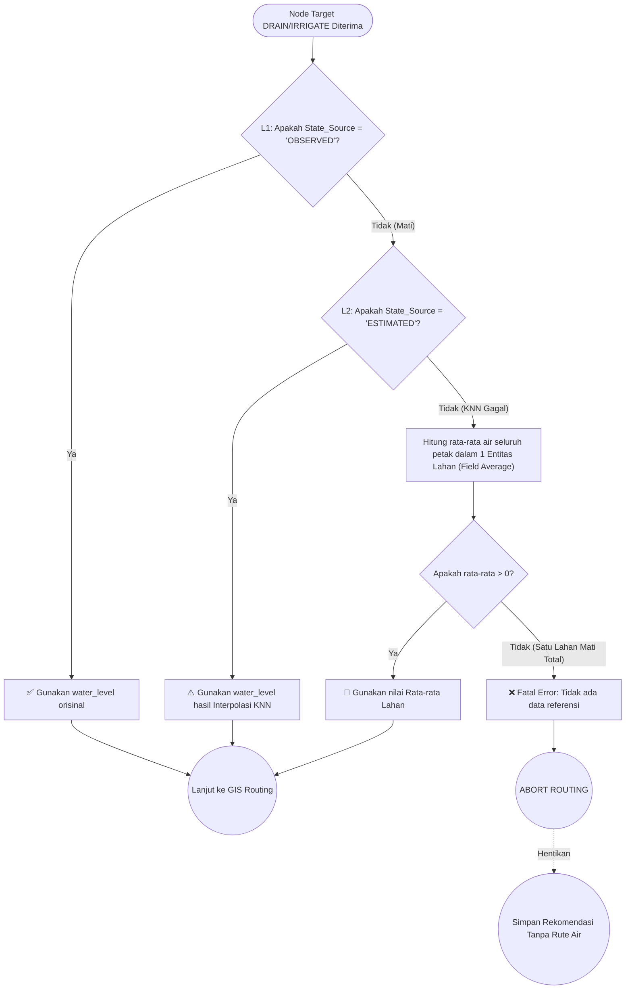

# 🛡️ TIER 2 (BackEnd): Node Resolver (4-Level Fallback)

## 1. Mekanisme Kerja
Terletak di `node-resolver.ts`. Sebelum Backend membiarkan *GIS Processing* mulai mencari rute dari target A ke B menggunakan *Floyd-Warshall*, ia harus memastikan setiap petak koordinat memiliki angka elevasi riil. Algoritma Spasial tidak menerima nilai `NULL`. Resolusi *Node* ini adalah sabuk pengaman tingkat tinggi agar sistem perhitungan air tidak panik (*Crash*).

## 2. Diagram Pohon Keputusan (Decision Tree)

## 3. Hubungan ke Modul Lain
- **Pembantu Modul Routing:** Modul ini dijalankan secara sekejap tepat di tengah-tengah antara hasil dari DSS Engine, sebelum merakit beban (*Payload*) untuk dikirim ke API `gis-processing`.
