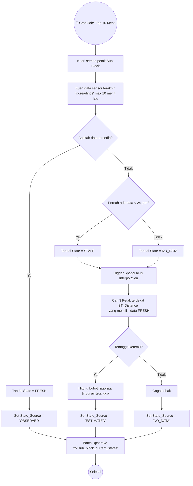

# ⏱️ TIER 2 (BackEnd): Scheduler & State Builder

## 1. Mekanisme Kerja
Berada pada `scheduler.service.ts` dan `state-builder.job.ts`. Inilah modul yang menyatukan potongan teka-teki data telemetri. Data sensor (`trx.readings`) yang masuk sering kali tidak konsisten (ada perangkat mati, baterai habis, dsb). *State Builder* menggunakan metode *K-Nearest Neighbors* spasial untuk "menebak" (*Interpolate*) nilai petak sawah yang sensornya sedang mati.

## 2. Diagram Alur Logika State Builder (Cron)

## 3. Hubungan ke Modul Lain
- Hasil dari tabel `trx.sub_block_current_states` inilah yang menjadi basis bagi Cron Job ke-dua (*Decision Cycle / Evaluator*) untuk dibungkus ke dalam JSON dan dikirim menuju **Model DSS Engine**.
