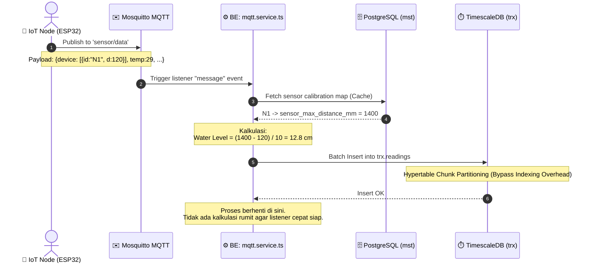

# 📡 TIER 2 (BackEnd): Telemetry Ingestion (MQTT)

## 1. Mekanisme Kerja
Modul `mqtt.service.ts` bertanggung jawab menjadi penyaring pertama bagi aliran data bervolume tinggi yang dikirimkan oleh ratusan perangkat lapangan. Agar tidak melumpuhkan server, proses masuk (*Ingestion*) dipisahkan secara ketat dari komputasi analisis.

### Kalibrasi Dinamis (*Dynamic Calibration*)
Sistem menangkap variabel jarak mentah (*Distance*) dari sensor ultrasonik. Modul ini melakukan kueri ke dalam *Map/Cache* dari DB `mst.sensor_calibrations` untuk mengubah jarak dari bibir paralon menjadi tinggi/kedalaman air riil yang akurat, terlepas dari berapapun ketinggian pemasangan sensor di lapangan (mis. 1400mm atau 1200mm).

## 2. Diagram Aliran Data Ingesti

## 3. Hubungan ke Modul Lain
- **Penghubung ke Scheduler:** Data mentah di `trx.readings` ini **tidak berguna bagi Frontend atau DSS** sampai diproses oleh Sub-Modul `State Builder` (yang berjalan di belakang layar) untuk diolah menjadi wujud keadaan saat ini (*Current State*).
