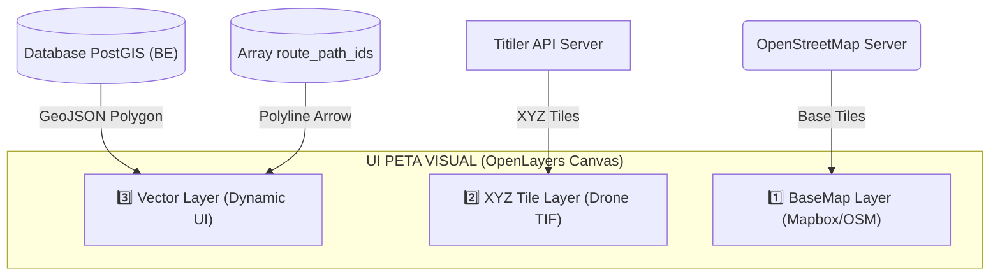

# 🗺️ TIER 5 (FrontEnd): OpenLayers Map Visualizer

## 1. Mekanisme Kerja
Berpusat pada file `MapVisualManager.tsx`. Penggunaan OpenLayers membedakan visualisasi proyek ini menjadi sebuah susunan *Burger* (Kue Lapis). Lapisan terbawah berupa Satelit/Peta Jalan, lapisan tengah berupa foto *Drone* kustom, dan lapisan teratas adalah lukisan vektor dinamis dari database.

## 2. Diagram Tumpukan Lapisan Peta (*Map Layers Architecture*)

## 3. Hubungan ke Modul Lain
Modul *FrontEnd* ini sangat rakus data. Lapisan ke-3 mengambil bentuk GeoJSON dari API Backend Express, sedangkan Lapisan ke-2 (XYZ Tile Layer) menarik gambar secara asinkron dari API `Titiler` Python. Jika terjadi kegagalan muat gambar di L2, operator masih bisa mengacu pada L1 (BaseMap) bawaan internet tanpa membuat aplikasi rusak.
