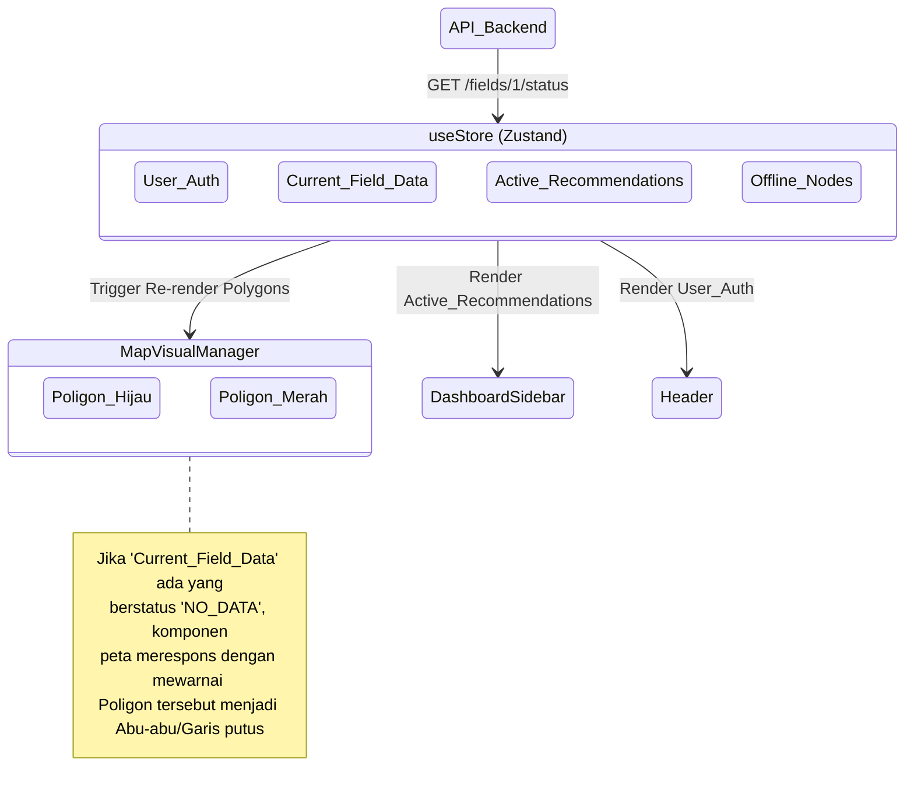

# 📦 TIER 5 (FrontEnd): State Manager (Zustand)

## 1. Mekanisme Kerja
Dalam aplikasi antarmuka peta *Single Page Application* yang kompleks, `props-drilling` (melempar data dari komponen Ayah ke Anak ke Cucu) akan membuat *re-render* yang mengerikan.
Oleh karena itu, modul ini akan sangat bergantung pada `Zustand` sebagai lumbung data global (*Global State Store*).

## 2. Diagram State Global & Aliran Pembaruan (*Update Flow*)

## 3. Hubungan ke Modul Lain
Setiap kali `client.ts` (Modul *Axios/Fetch*) menerima data terbaru hasil kalkulasi Backend, ia menuliskannya ke Store. Komponen visual tidak menembak Backend secara langsung; ia hanya "berlangganan" (*Subscribe*) terhadap perubahan di Zustand Store.
