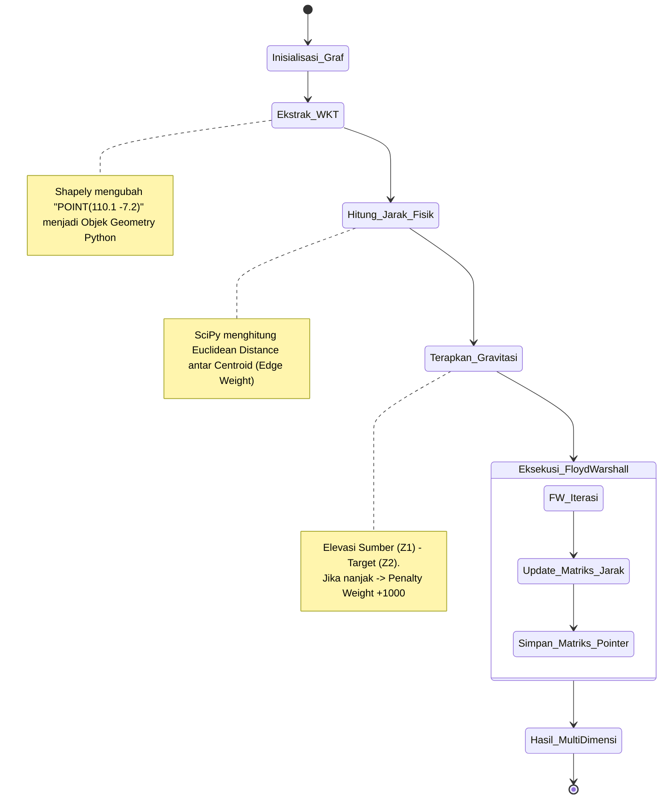

# 📐 TIER 4 (GIS): All-Pairs Shortest Path (APSP) Algorithm

## 1. Mekanisme Kerja
Di dalam `gis_risang/ricemesh-gis-processing`. Algoritma Spasial tidak menggunakan metode konvensional A* atau Dijkstra karena kita tidak mencari dari 1 ke 1. Kita membangun graf seluruh koneksi tumpahan petak sawah menggunakan `NetworkX`. 
Algoritma utamanya adalah **Floyd-Warshall** yang menghitung biaya jarak dari semua titik ke semua titik (APSP).

## 2. Diagram Logika Komputasi Spasial

## 3. Kaitan Khusus (Technical Relation)
Penerapan *Penalty Elevasi* harus diawasi oleh Teknisi Lapangan karena kemiringan lahan akan menentukan ke mana pompa air membuang kelebihan genangan. Hasil keluaran (`Distance` dan `Predecessor Matrices`) akan diterjemahkan oleh Endpoint `/matrix`.
