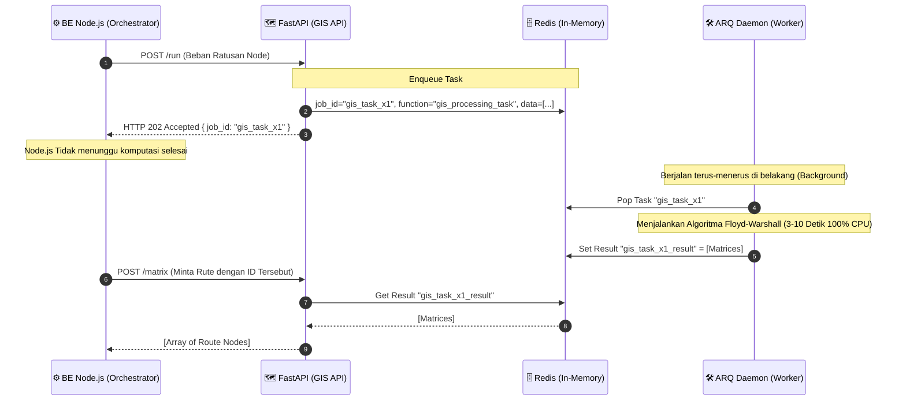

# ⏱️ TIER 4 (GIS): ARQ Redis Worker

## 1. Mekanisme Kerja
Jika *Frontend* menanyakan rute air secara terus-menerus dan algoritma di *TIER 4* (Floyd-Warshall) dilakukan di dalam fungsi `async def /run`, maka API Python FastAPI akan memblokir (*Blocked*) server karena komputasi matriks V³ itu *Synchronous CPU Bound*.
Mekanisme `arq` dengan `Redis` mengatasi hal ini dengan sistem "Titip Pesan" (*Task Queue*).

## 2. Diagram Aliran Queue ARQ

## 3. Prasyarat Operasional
Modul ini menghubungkan dua dunia: Web API dan Terminal Daemon. Membutuhkan Docker *Redis* untuk dijalankan bersama *Worker* (`uv run arq arq_worker.settings.WorkerSettings`).
