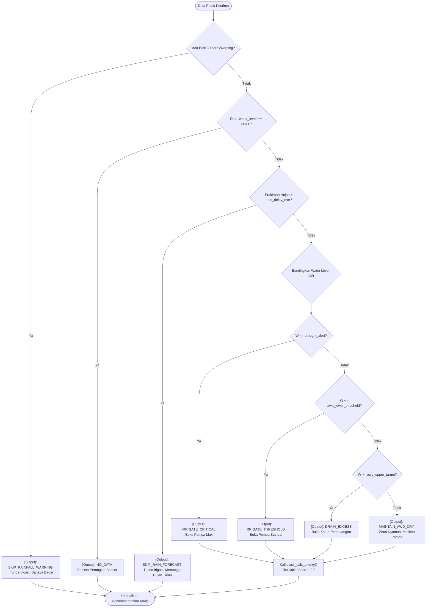

# 🤖 TIER 3 (Model): Decision Support System Engine

## 1. Mekanisme Kerja
Modul inti dari proyek. Berada di `app/modules/decision_engine/engine.py`. Modul ini bersifat kaku (*Strict*) dan menggunakan struktur aturan Hierarki Veto (*Veto Hierarchy*) untuk mencegah sistem melakukan tindakan yang membahayakan sawah (misalnya memompa air masuk ke sawah saat akan datang badai petir).

## 2. Diagram Logika Aliran Keputusan (*Decision Flowchart*)

## 3. Hubungan ke Modul Lain
- Input dari modul ini 100% dipasok oleh Node.js Backend (`engine-client.service.ts`).
- Modul ini **tidak berhubungan langsung dengan Database**. Jika terjadi kesalahan logika, pemecahannya murni pada perombakan skrip `.py` dan validasi *Pydantic*, tanpa perlu mengubah skema DB.
