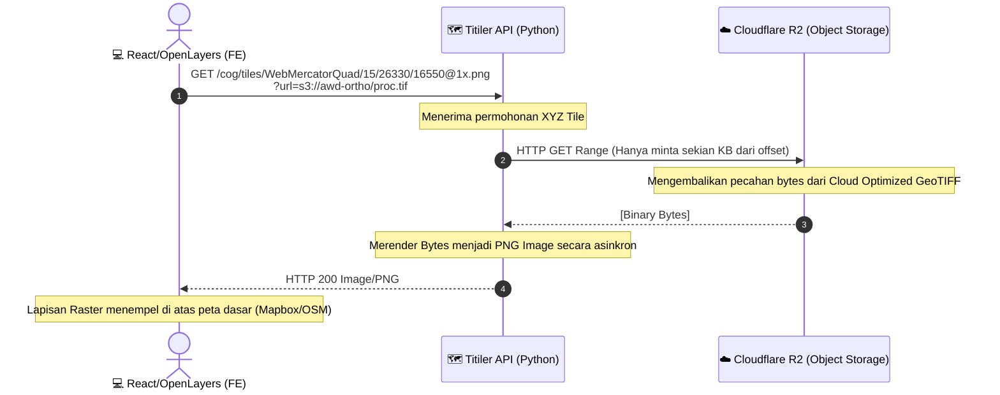

# 🗺️ TIER 3 (Model): Titiler COG Server

## 1. Mekanisme Kerja
Titiler adalah server pemetaan dinamis berbasis Python (FastAPI). Ia bertugas merender *XYZ Tiles* secara *On-The-Fly* (langsung). Petani/Operator lapangan ingin melihat keadaan nyata dari pemotretan *drone* bulan lalu di aplikasinya. Foto hasil jahit bernilai resolusi triliunan pixel tersebut (`.tif`) disimpan di penyimpanan eksternal untuk menghemat biaya hardisk server kita.

## 2. Diagram Alir Data Titiler & Cloudflare

## 3. Hubungan ke Modul Lain
- Modul ini tidak berhubungan dengan Backend Node.js.
- Titiler murni dikonsumsi secara langsung oleh **FrontEnd (React)** melalui pemanggilan alamat URL *layer* yang di-pasang di `OpenLayers`.
