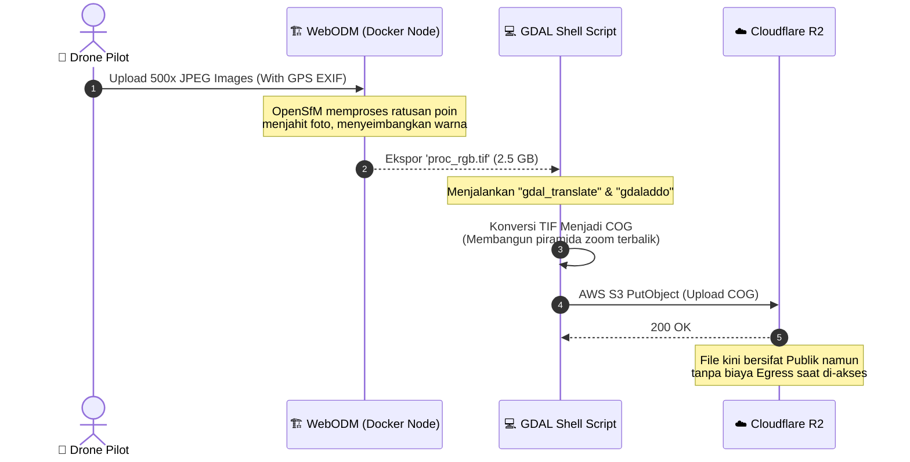

# ☁️ TIER 6 (Data Pipeline): WebODM & COG Pipeline

## 1. Mekanisme Kerja
Bagaimana mengubah ratusan foto JPEG mentah dari kamera satelit/drone agar menjadi satu peta super resolusi yang bisa dibuka lewat peramban web? Ini adalah proses pipanisasi (*Pipelining*) arsitektur *Cloud*. WebODM menangani pemrosesan lokal berat, `GDAL` untuk penerjemahan format, dan *Cloudflare R2* sebagai lumbung data bebas pungutan batas wilayah.

## 2. Diagram Aliran Pemrosesan Fotogrametri

## 3. Titik Temu Sistem (*System Integration*)
Output (*Keluaran*) dari alur ini akan ditaruh di *Cloudflare R2 Bucket*, yang kemudian akan dikonsumsi URL-nya oleh **Titiler Model** (Python) di *TIER 3* agar bisa dilukis menjadi kotak-kotak peta (*Tiles*) di *Frontend*.
Penyimpanan file COG ini juga memungkinkan kita untuk mendirikan server peta untuk desa lain tanpa perlu menambah pangkalan data.
