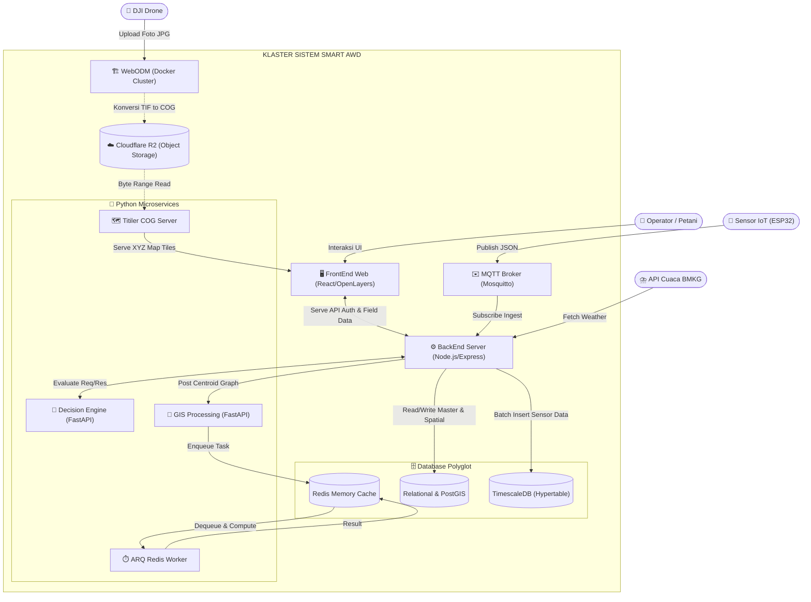

# 🏗️ TIER 1: Arsitektur Utama Sistem (C4 Model)

## 1. Ikhtisar Arsitektur
Proyek Smart AWD dipecah menjadi beberapa *Microservices* yang memiliki tugas spesifik untuk menghindari titik tunggal kegagalan (*Single Point of Failure*). Diagram di bawah ini merepresentasikan Model Arsitektur C4 tingkat *Container/Component* yang menunjukkan aliran komunikasi antar-modul di *Cloud/On-Premise*.

## 2. Diagram C4 Komponen & Aliran Data

## 3. Penjelasan Interaksi
- **Pemisahan Penayangan Peta:** Backend Node.js sama sekali tidak memproses aset gambar peta. *FrontEnd* menarik lapisan poligon dan data rekomendasi dari Backend, tetapi menarik ubin peta (*Tiles*) secara terpisah dari `Titiler` yang terhubung langsung ke `Cloudflare R2`.
- **Komunikasi Internal (Internal Network):** Komunikasi antara Node.js dengan Python (DSS Engine dan GIS) dilakukan secara REST API privat tanpa ter-ekspos ke internet luar.
- **Isolasi Tugas Berat:** Semua beban perhitungan berat (*All-Pairs Shortest Path*) dilepaskan ke luar FastAPI melalui antrean *Redis* dan diproses oleh *Worker Daemon*.
