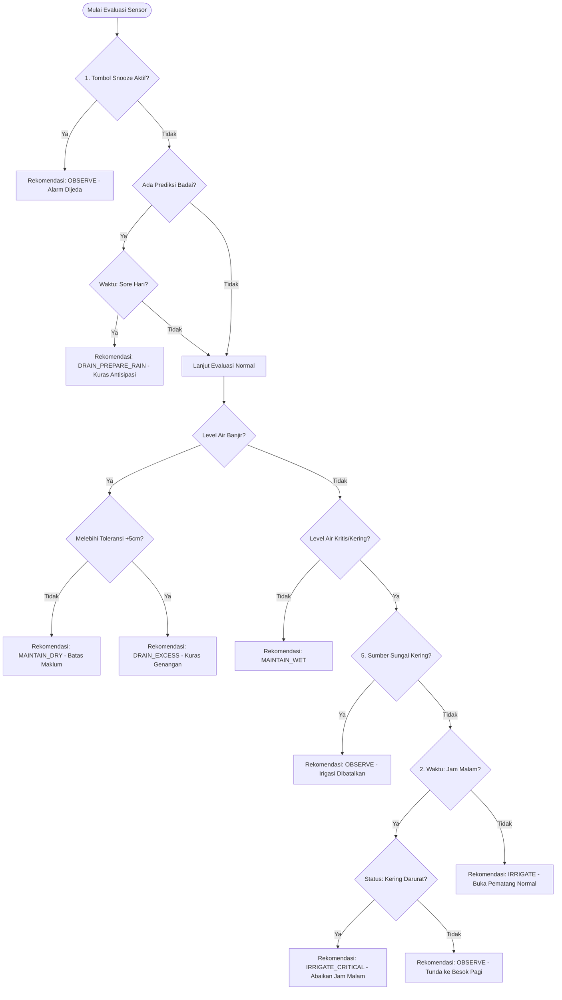

# Smart AWD: Resilience & Defense Mechanisms (Logika Ketangguhan)

Dokumen ini mendokumentasikan 5 pilar mekanisme pertahanan (*defense mechanisms*) yang ditanamkan ke dalam **Decision Support System (DSS)** pada `engine.py`. Sistem ini dirancang untuk memastikan algoritma irigasi tahan terhadap anomali alam, keterbatasan infrastruktur fisik, dan menghindari bahaya operasional bagi petani (misalnya, banjir malam hari akibat ketiduran).

## 1. Tolerance Hysteresis (Batas Maklum / Anti Ping-Pong)
Sistem memiliki batas toleransi statis `DRAIN_TOLERANCE_CM = 5.0` cm.
*   **Masalah:** Saat air diisi ke target (misal `+5 cm`), ada kemungkinan air meluap sedikit menjadi `+7 cm` karena keterlambatan petani menutup pintu/pematang. Jika tidak ada histeresis, DSS akan langsung menyuruh `DRAIN` (kuras), padahal satu jam yang lalu baru disuruh `IRRIGATE`. Ini membuat sistem *spamming/cerewet*.
*   **Solusi Logika:** DSS hanya akan mentrigger `DRAIN_EXCESS` jika ketinggian air sudah melampaui `awd_upper_target_cm + DRAIN_TOLERANCE_CM`. Luapan kecil dibiarkan dan diatasi oleh evaporasi alami (`MAINTAIN_DRY`).

## 2. Night Block (Blokir Jam Malam Operasional)
Sistem memblokir instruksi irigasi rutin saat hari mulai gelap.
*   **Waktu Aktif:** Pukul 17:00 (Sore) hingga 04:59 (Pagi) waktu setempat (WIB).
*   **Masalah:** Mengisi air sawah manual bisa memakan waktu berjam-jam. Jika DSS menyuruh mengisi air jam 19:00, petani berisiko ketiduran. Air akan tumpah ruah semalaman merendam tanaman hingga kehabisan oksigen.
*   **Solusi Logika:** Pada jam malam, jika status lahan adalah `IRRIGATE` (di bawah batas bawah AWD), DSS secara otomatis menimpa status tersebut menjadi `OBSERVE` dengan pesan peringatan: *"Peringatan Jam Malam: Tunda pengisian air hingga besok pagi"*.
*   **Pengecualian:** Jika level air sangat kritis (Drought Alert), jam malam **diabaikan** dan alarm `IRRIGATE_CRITICAL` tetap berbunyi.

## 3. Pre-emptive Afternoon Drain (Kuras Antisipasi Sore Hari)
Sistem memiliki mata "Masa Depan" untuk mencegah kebanjiran malam hari.
*   **Waktu Aktif:** Pukul 13:00 hingga 16:59 WIB.
*   **Masalah:** Hujan badai lebat malam hari tidak bisa diantisipasi oleh petani yang sedang tidur. Jika sawah dibiarkan pada kondisi genangan batas atas di sore hari, badai malam akan memicu banjir parah.
*   **Solusi Logika:** Jika waktu saat ini adalah sore hari **DAN** BMKG memprediksi hujan lebat (`is_heavy`) akan tiba pada malam harinya, DSS memaksa status lahan Normal menjadi `DRAIN_PREPARE_RAIN`. Petani bisa mengosongkan sawah sebelum matahari terbenam untuk menyambut volume hujan badai.

## 4. Snooze Override (Jeda Alarm Pematang Jebol)
Penangguhan evaluasi DSS demi pekerjaan fisik manual.
*   **Masalah:** Jika pematang jebol karena tikus atau cuaca, air akan surut ekstrem di satu petak dan meluap di petak bawahnya. Perbaikan pematang bisa memakan waktu berhari-hari. DSS akan berteriak *Error* terus-menerus.
*   **Solusi Logika:** Jika ada input `management_flags` bertipe `snooze_dss` (diset via UI oleh pengguna), *Decision Engine* akan melewatkan proses evaluasi dan langsung mencetak `OBSERVE`. Alarm ditangguhkan sepenuhnya.

## 5. Drought Override (Deklarasi Kemarau/Sumber Kering)
Pencegahan instruksi irigasi yang sia-sia saat bendungan pusat surut.
*   **Masalah:** Jika sistem mendeteksi sawah sangat kering (`-20 cm`), ia akan panik menyuruh *"SEGERA BUKA SUMBER"*. Jika sungai sumbernya kering kerontang, alarm ini tidak berguna dan hanya meresahkan petani.
*   **Solusi Logika:** Jika paramater konteks lahan `is_source_depleted` bernilai `True`, semua logika `IRRIGATE` dan `IRRIGATE_CRITICAL` otomatis diredam menjadi `OBSERVE` dengan keterangan: *"Irigasi Dibatalkan: Petani melaporkan sumber air/sungai utama kering total."*

---
> Keseluruhan lima sistem pertahanan di atas telah berhasil melewati **Uji Fuzzing (Massive Combinatorial Testing)** dengan total **640 skenario acak ekstrem** tanpa ada satupun kegagalan/kebocoran logika. (Lulus 100%).

## 6. Visualisasi Alur Pertahanan (Defense Logic Flowchart)

Berikut adalah diagram *Mermaid* yang mengilustrasikan bagaimana kelima mekanisme pertahanan tersebut memotong (*intercept*) atau mengubah keputusan irigasi normal:

