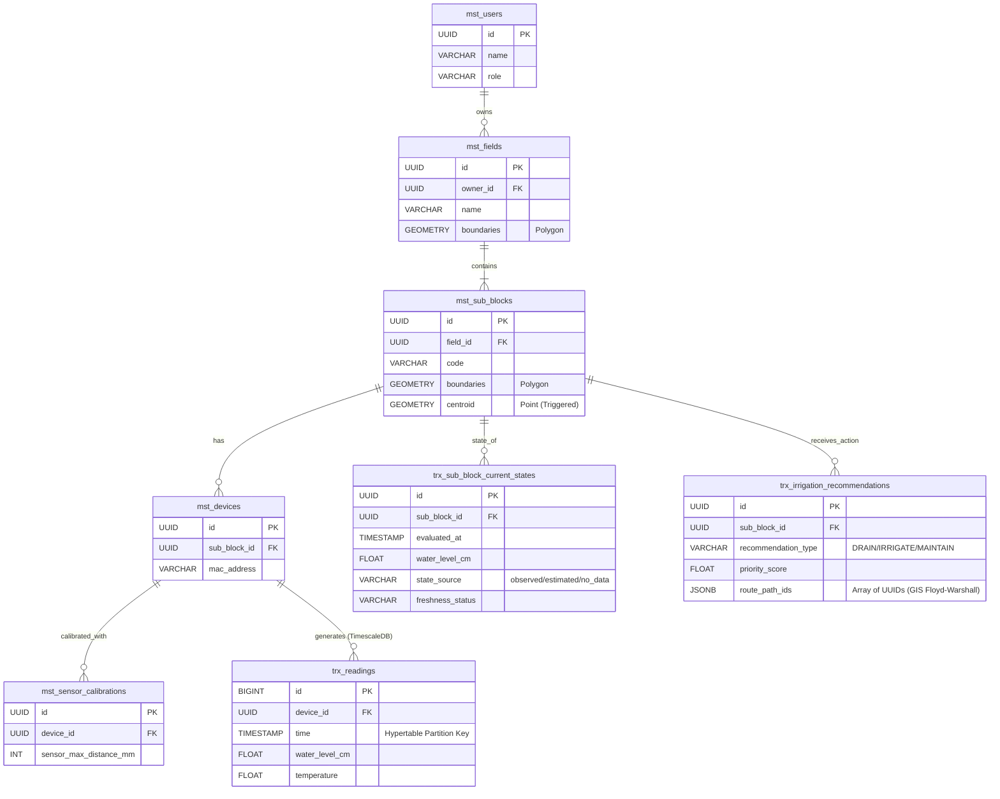

# 🗃️ Diagram Relasi Database (ERD)

Kita memiliki arsitektur *Polyglot Database* yang membagi data Master (`mst`) dengan data Transaksi (`trx`). Diagram di bawah ini menjabarkan interaksi *Foreign Key* (Kunci Tamu) menggunakan standar *Crow's Foot Notation*.

## Entity Relationship Diagram (Mermaid)

## Penjelasan Relasi Kritis
1. **Centroid Auto-Trigger:** Tabel `mst_sub_blocks` memiliki kolom `centroid`. Anda tidak boleh mengisi ini secara manual. Cukup masukkan `boundaries` (titik-titik pinggir sawah), dan *Postgres Trigger* akan otomatis menjadikannya titik tengah ber-koordinat pasti untuk keperluan graf irigasi.
2. **TimescaleDB:** `trx_readings` terikat dengan perangkat IoT, namun tidak di-*index* secara B-Tree standar. Ia di-*partition* oleh *TimescaleDB* berdasarkan kolom `time`.
3. **Route Injection:** `trx_irrigation_recommendations` menampung kolom tipe JSONB `route_path_ids`. Berisi himpunan ID (berurutan) dari `mst_sub_blocks` yang merepresentasikan pergerakan air.
