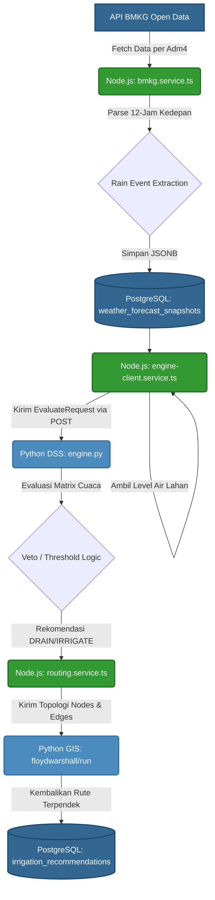

# Dokumentasi Teknis: BMKG Rain Event Detection & DSS Integration

Dokumen ini membedah arsitektur dan algoritma yang digunakan untuk mengubah data mentah prediksi cuaca (BMKG) menjadi keputusan irigasi otonom berbasis *Decision Support System* (DSS).

## 1. Arsitektur Data Flow (End-to-End)

Berikut adalah diagram alir bagaimana cuaca dikonsumsi dan diterjemahkan menjadi jalur air yang optimal:



## 2. Rain Event Extraction Algorithm

Sistem **tidak lagi** menjumlahkan seluruh potensi hujan dalam kurun 24 jam menjadi satu angka mutlak. Sistem baru membaca slot 3-jaman dari BMKG dan mengekstrak **Kejadian Hujan (*Rain Event*)**:

1. **Filtering:** Mengambil maksimal 4 slot waktu (12 jam ke depan).
2. **Thresholding:** Sebuah slot dianggap `wet` jika curah hujan (`tp`) mencapai ≥ 2.0 mm.
3. **Grouping:** Menyatukan slot-slot `wet` yang berurutan menjadi satu buah kejadian (`RainEvent`).
4. **Metadata Extraction:** Menghitung durasi hujan, kapan mulainya (`hours_until_rain`), dan puncak terlebatnya (`peak_intensity_mm`).

## 3. Matrix Keputusan DSS (Veto Cuaca)

DSS menerima `RainEvent` ini, lalu mencari event yang akan datang dalam waktu **< 12 jam**. Kemudian, ia akan membandingkan ancaman hujan ini dengan kondisi aktual level air (`wl`) pada setiap sub-blok. 

Berikut tabel matriks keputusan yang memandu operasi irigasi:

| Kondisi Air Kotak | Hujan Segera (< 3 jam), Lebat (Peak ≥ 8mm) | Hujan Segera (< 3 jam), Sedang (< 8mm) | Hujan Datang Nanti (3-12 jam lagi) | Tidak Ada Hujan |
|---|---|---|---|---|
| **Hampir Banjir** (`> upper + 2cm`) | 🚨 `DRAIN_CRITICAL_RAIN` *(Darurat!)* | `DRAIN_EXCESS` | 🚨 `DRAIN_CRITICAL` | `DRAIN_EXCESS` |
| **Tinggi** (`≥ awd_upper`) | ⚠️ `DRAIN_URGENT_RAIN` *(Buka sekarang)* | `DRAIN_PREPARE_RAIN` *(Buka persiapan)* | `DRAIN_PREPARE_RAIN` | `DRAIN_EXCESS` |
| **Normal** (AWD range) | ⏳ `HOLD_RAIN_COMING` *(Tunda)* | ⏳ `HOLD_RAIN_SOON` *(Tunda)* | ⏳ `HOLD_RAIN_FORECAST` *(Tunda)* | `MAINTAIN_AWD_DRY` |
| **Kering** (`≤ awd_lower`) | ⏳ `HOLD_RAIN_COMING` *(Tunda)* | 💧 `IRRIGATE_THRESHOLD` | 💧 `IRRIGATE_BEFORE_RAIN` *(Segera isi)* | `IRRIGATE_THRESHOLD` |
| **Kritis Kering** (`≤ drought_alert`) | 🔥 **`IRRIGATE_CRITICAL`** *(Exception/Tetap Isi)*| 🔥 `IRRIGATE_CRITICAL` | 🔥 `IRRIGATE_CRITICAL` | `IRRIGATE_CRITICAL` |

> [!CAUTION]
> **Pengecualian Kritis (Drought Alert):** Seperti yang terlihat pada baris paling bawah, jika sensor air menyentuh batas `drought_alert_cm`, sistem **mengabaikan semua prediksi hujan**. Hujan selebat apapun tidak akan dihiraukan karena menyelamatkan tanaman dari kematian mendadak akibat kering kerontang jauh lebih diprioritaskan ketimbang menunggu hujan.

## 4. Format Payload (DSS API Contract)

Sistem telah di standarisasi menggunakan tipe data yang sama di Backend dan di Python.

**Contoh Payload Cuaca yang Dikirim ke DSS:**
```json
"weather": {
  "is_stale": false,
  "peak_intensity_mm": 12.5,
  "rain_events": [
    {
      "starts_at": "2026-06-20T13:00:00.000Z",
      "ends_at": "2026-06-20T19:00:00.000Z",
      "hours_until_rain": 2.5,
      "duration_hours": 6,
      "total_mm": 15.0,
      "peak_intensity_mm": 12.5,
      "intensity_label": "heavy"
    }
  ]
}
```

Format ini memampukan fleksibilitas penuh di sisi Machine Learning / DSS tanpa harus me- *redeploy* aplikasi backend jika suatu hari metrik parameter cuacanya diperluas.
